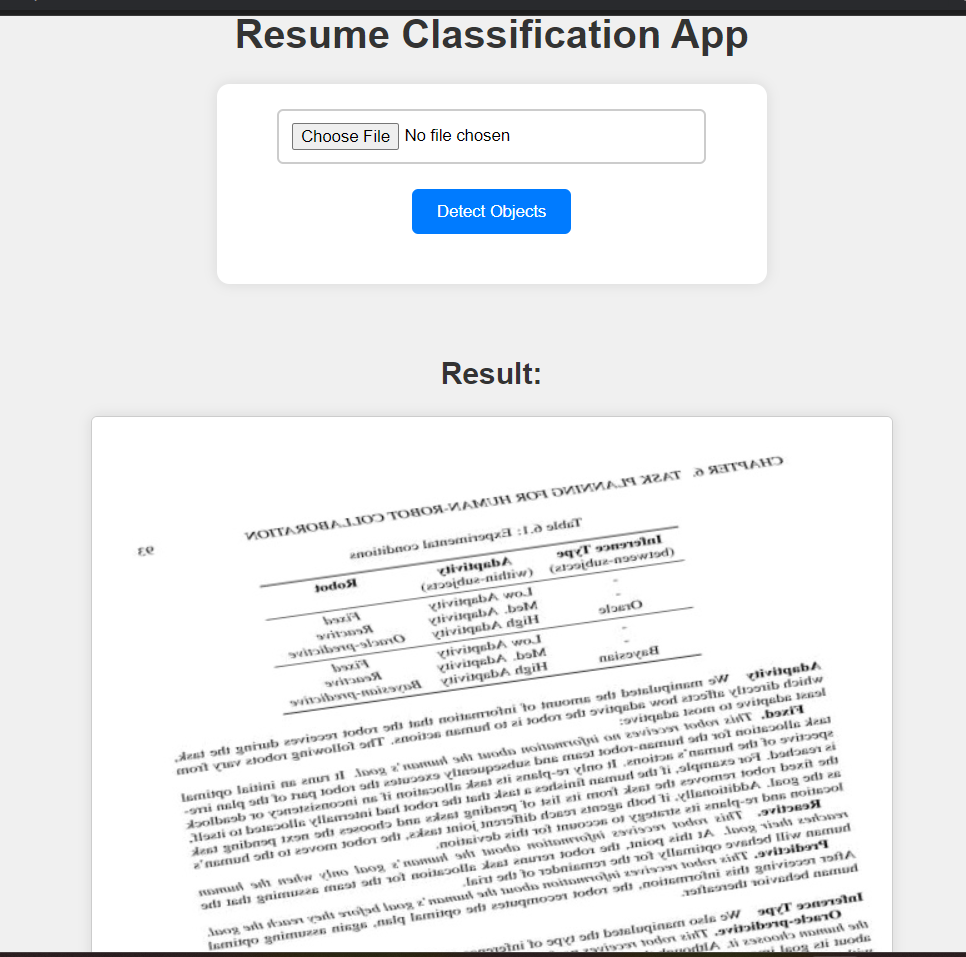

# Resume Classification Using Deep Learning

Welcome to the Resume Classification project repository! This project involves the use of deep learning techniques to classify resumes. Below are the steps to get started:

## Quick Start

1. **Clone the Repository:**
    ```bash
    git clone https://github.com/Vikas-ABD/Resume_Classification.git
    cd Resume_Classification
    ```

2. **Install Dependencies:**
    ```bash
    pip install -r requirements.txt
    ```

3. **Image Classification:**
    To classify a given image, run:
    ```bash
    python classify.py --path <path_of_your_image>
    ```

4. **Web Application:**
    For a user-friendly application, run:
    ```bash
    python ./app/flaskapp.py
    ```
    Visit [http://127.0.0.1:5000](http://127.0.0.1:5000) in your web browser to use the application.

## Usage

- **Image Classification:**
  - Run the `classify.py` script with the path to your image.
  - View the classification result on the screen.

- **Web Application:**
  - Start the Flask web application using `flaskapp.py`.
  - Access the application at [http://127.0.0.1:5000](http://127.0.0.1:5000).
  - Upload an image to get the classification result with the image displayed.

  

## Notebooks

- **Data Collection and Augmentation:**
  - Explore the data collection and augmentation process in the `Data_Collection_and_Augmentation.ipynb` notebook.

- **Model Training and Evaluation:**
  - Learn more about model selection, creation, training, and evaluation in the `Train_Evaluation_Test.ipynb` notebook.


#  Dataset Collection
## Data Sources
Utilized Roboflow as the primary data collection source, collecting approximately 150 images for both resume and non-resume classes.

##  Class Distribution
- Resume Images: 150
- Non-Resume Images: 150

### Additional Details: for resume class i got data from roboflow opensource but for non-resume I collected various types of data mention above for you
- Newspapers: 30
- Bills and Personal Collection (Phone): 30
- Open Source Research Papers: ~90

## Dataset Diversity
Ensured dataset diversity by incorporating images from various sources, including newspapers, bills, personal collections, and open-source research papers.


## Additional Information

- **Overall Analysis:**
  - For a detailed analysis, refer to the `overall_report.pdf` file in the main directory.


Feel free to explore the repository and contribute! If you encounter any issues or have questions, please open an issue.

Happy coding!

